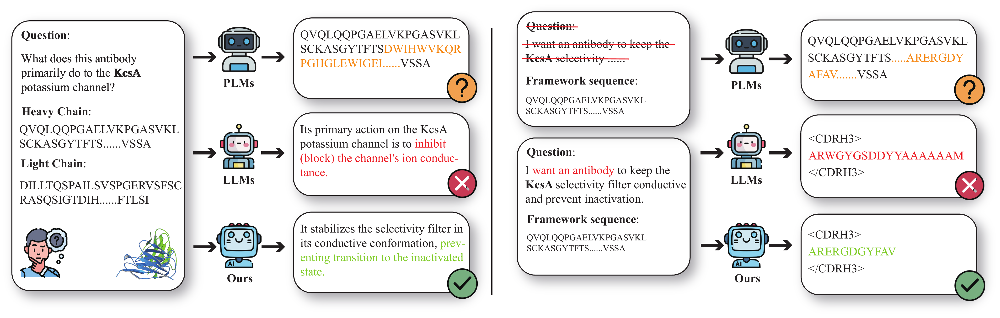

# AFD-INSTRUCTION: A Comprehensive Antibody Instruction Dataset with Functional Annotations for LLM-Based Understanding and Design

<div align="center">

[](https://huggingface.co/datasets/LLMasterLL/AFD)
[](https://openreview.net/pdf?id=H8tismBT3Q)
[](https://pytorch.org/)
[](https://github.com/unslothai/unsloth)

</div>

This repository provides the implementation code for fine-tuning large language models on antibody instruction datasets with functional annotations, enabling LLM-based understanding and design of antibodies.



## News

- **[January 26, 2026]** Our paper AFD-INSTRUCTION: A Comprehensive Antibody Instruction Dataset with Functional Annotations for LLM-Based Understanding and Design is accepted by `ICLR 2026` 🎉
- **[August 2025]** We've completed model development and evaluation.
- **[June 2025]** We've completed the construction of the AFD-INSTRUCTION dataset.

## Installation

### Environment Setup

1. **Create conda environment:**
```bash
conda env create -f environment.yml
conda activate afd
```

2. **Install additional dependencies:**
```bash
pip install "unsloth[colab-new] @ git+https://github.com/unslothai/unsloth.git"

pip install openai python-dotenv

pip install pyrosetta-installer

python -c "import pyrosetta_installer; pyrosetta_installer.install_pyrosetta()"
```

## Training

### Data Format

Training data should be in JSONL format, where each line contains a JSON object with:
- `pdb_id`: Identifier for the antibody structure
- `messages`: A list of message objects with:
  - `from`: Role identifier ("human" or "gpt")
  - `value`: The message content

> **Note**: We provide a toy dataset in `data/toy.jsonl` **only for demonstration purposes** to showcase the training pipeline. For actual training, please use the full dataset available on [Hugging Face](https://huggingface.co/datasets/your-username/afd-instruction).

Each entry contains an antibody sequence (heavy chain `<H>...</H>` and light chain `<L>...</L>`) along with a question-answer pair.

Example entry:
```json
{
  "pdb_id": "8zc6",
  "messages": [
    {
      "from": "human",
      "value": "<H>VQLVQSGAEVKKPGASVKVSCKASGYIFSDYNIHWVRQAPGQGLEWMGWISPDSDDTNYAQSFQGRVTMTRDTSITTVYMELSSLRSDDTAVYFCARSVGYCSLNSCQRWMWFDTWGQGALVTVSSA</H> <L>PVLTQPPSASGPPGQSVSISCSGSRSNIGTNFVYWYQQLPGAAPKLLIYKNDQRPSGVPERFFGSKSGTSASLAISGLRSEDEVDYYCAAWDDSLSGHVFGAGTKVTVLGQ</L> Why is this antibody resilient against common escape mutations?"
    },
    {
      "from": "gpt",
      "value": "Its binding to a non-canonical epitope confers resilience against such mutations."
    }
  ]
}
```

### Training Configuration

Training parameters are configured in `finetune/config/train_param.json`. Key configuration sections:

- **paths**: Model paths and data locations
  - `base_model`: Base model to fine-tune (e.g., `"meta-llama/Meta-Llama-3-8B"`)
  - `data_file`: Path to training data (default: `"./data/toy.jsonl"` for demo; use the full dataset for actual training)
  - `output_dir`: Directory for training outputs and checkpoints
  - `save_dir`: Directory to save the final fine-tuned model

- **unsloth**: Unsloth optimization settings
  - `load_in_4bit`: Enable 4-bit quantization for memory efficiency
  - `use_gradient_checkpointing`: Enable gradient checkpointing

- **lora**: LoRA (Low-Rank Adaptation) parameters
  - `r`: LoRA rank
  - `lora_alpha`: LoRA alpha scaling factor
  - `lora_dropout`: LoRA dropout rate
  - `target_modules`: Modules to apply LoRA to

- **training**: Training hyperparameters
  - `learning_rate`: Learning rate
  - `num_train_epochs`: Number of training epochs
  - `per_device_train_batch_size`: Batch size per device
  - `gradient_accumulation_steps`: Gradient accumulation steps

### Running Training

Start training with the default configuration:

```bash
bash scripts/run_train.sh
```

The trained model will be saved to the directory specified in `save_dir`. The saved model includes:
- `adapter_config.json`: LoRA adapter configuration
- `adapter_model.bin`: LoRA adapter weights
- Tokenizer files

## Inference

### Using the Fine-tuned Model

After training, use the fine-tuned model for inference. We provide an interactive inference interface:

#### Interactive Inference

For interactive chat with the model:

```bash
bash scripts/run_inference.sh
```

The interactive mode allows you to ask questions about antibody sequences in real-time. Type `quit` or `exit` to end the session.

**Input Format**: The model expects input in the format:
```
<H>HEAVY_CHAIN_SEQUENCE</H> <L>LIGHT_CHAIN_SEQUENCE</L> Your question about the antibody?
```

## Citation

If you find this work useful, please cite our paper:

```bibtex
@inproceedings{luo2026afd,
  title={AFD-INSTRUCTION: A Comprehensive Antibody Instruction Dataset with Functional Annotations for LLM-Based Understanding and Design},
  author={Ling Luo and Wenbin Jiang and Xushi Zhang and Hongyuan Chang and Xinkang Wang and Yueting Xiong and Mengsha Tong and Rongshan Yu},
  booktitle={International Conference on Learning Representations (ICLR)},
  year={2026}
}
```
